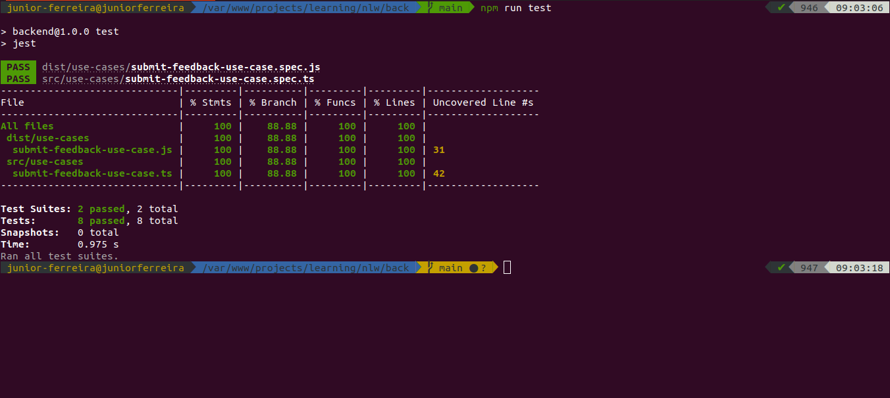

#NLW Return Impulse
#### _Backend Application_

This is a project developed during the NLW Return Impulse of [Rocketseat](rocketseat.com.br).
It is the backend developed in Node.JS, TypeScript, PrismaIO, Sending emails, Database and Tests. SOLID principles were applied to raise the application level to a stage that facilitates maintenance and understanding, as well as good programming practices.

Requirements
- Node.js
- NPM
- Express
- Prisma
- Jest
- Nodemailer
- *SQlite only during the development process 
- ✨You can also use Docker to setup the environment✨


## Installation

```sh
-git clone https://github.com/adelino-masioli/nlw-impulse-server
-cd nlw-impulse-server
-npm i
-Prisma IO - https://www.prisma.io/docs/
-create a .env file and set: DATABASE_URL="file:./dev.db"
-npm run dev
```

### Screenshot



### Developer
Adelino Masioli adelinomasioli@gmail.com - 2022